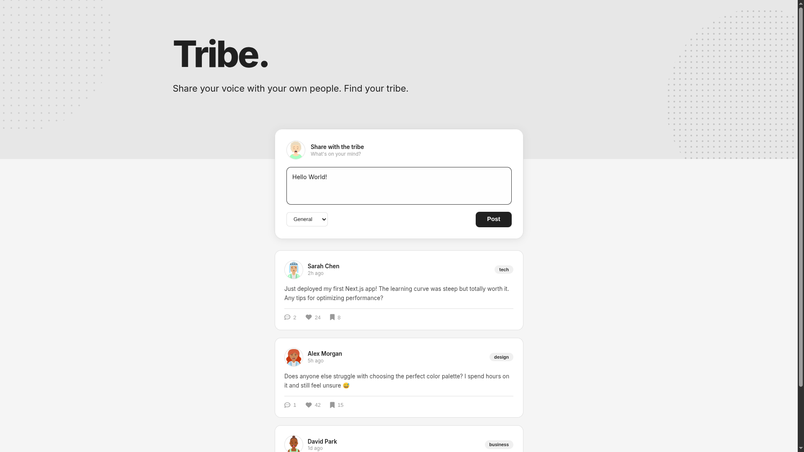

# 💬 Tribe - Community Forum




A modern, minimalist community forum application where users can share thoughts, engage in discussions, and connect with their tribe. Built with vanilla JavaScript and featuring an elegant design.

## 🌟 Features

- 📝 **Create Posts** - Share your thoughts with category tagging
- ❤️ **Like Posts** - Show appreciation for content you enjoy
- 🔖 **Bookmark Posts** - Save posts for later reading
- 💬 **View Replies** - Toggle to show/hide discussion threads
- 🎨 **Category System** - Organize posts by topic (General, Tech, Design, Business, Lifestyle)
- 🎭 **Dynamic Avatars** - Unique avatar generation using DiceBear API
- ✨ **Smooth Interactions** - Elegant hover effects and transitions
- 📱 **Responsive Design** - Works beautifully on all devices

## 🚀 Live Demo

**[View Live Demo](https://exc1d.github.io/tribe/)**

## 🎨 Design Philosophy

Tribe features a minimalist, elegant design:

- **Light Color Palette** - Clean whites and subtle grays
- **Bold Typography** - Large, impactful headings with Inter font
- **Artistic Hero Section** - Line-art pattern decorations
- **Subtle Interactions** - Refined hover effects and shadows
- **Professional Look** - Portfolio-worthy design quality

## 💻 Key JavaScript Concepts

### Event Delegation Pattern

```javascript
document.addEventListener("click", (e) => {
  const target = e.target.closest(
    "[data-like], [data-bookmark], [data-reply], #post-btn"
  );

  if (!target) return;

  if (target.dataset.like) {
    handleLikeClick(target.dataset.like);
  }
  // ... other handlers
});
```

### State Management with Array Methods

```javascript
function handleLikeClick(postId) {
  const targetPost = forumData.find((post) => post.uuid === postId);
  if (!targetPost) return;

  targetPost.isLiked ? targetPost.likes-- : targetPost.likes++;

  targetPost.isLiked = !targetPost.isLiked;
  render();
}
```

### Dynamic HTML Generation

```javascript
function getFeedHtml() {
  let feedHTML = "";

  forumData.forEach((post) => {
    feedHTML += `
      <div class="post">
        <!-- Post content -->
      </div>
    `;
  });

  return feedHTML;
}
```

### Creating New Posts

```javascript
function handlePostBtnClick() {
  const newPost = {
    username: "You",
    avatar: "https://api.dicebear.com/7.x/avataaars/svg?seed=User",
    category: category.value,
    content: postInput.value,
    // ... other properties
    uuid: uuidv4(),
  };

  forumData.unshift(newPost);
  render();
}
```

## 📂 Project Structure

```
tribe/
│
├── index.html          # HTML structure
├── styles.css          # All styling and animations
├── script.js           # JavaScript functionality
├── data.js             # Forum posts data
└── README.md           # Project documentation
```

## 🛠️ Technologies Used

- **HTML5** - Semantic markup
- **CSS3** - Modern styling, flexbox, custom properties
- **Vanilla JavaScript (ES6+)** - Modules, arrow functions, array methods
- **UUID v4** - Unique post identifiers
- **Font Awesome 6** - Icon library
- **DiceBear API** - Avatar generation
- **Google Fonts** - Inter font family

## 🎯 Core Functionality

### 1. Like System

- Toggle like state with boolean flag
- Increment/decrement like count
- Visual feedback with red heart icon
- State persists during session

### 2. Bookmark System

- Save posts for later reading
- Toggle bookmark state
- Visual feedback with yellow bookmark icon
- Independent from like system

### 3. Reply Toggle

- Show/hide reply threads
- Click to expand discussions
- Hidden by default for clean UI
- Smooth toggle transitions

### 4. Post Creation

- Multi-line text input
- Category selection dropdown
- Input validation (no empty posts)
- Posts added to top of feed
- Auto-clear input after posting

### 5. Dynamic Feed Rendering

- Builds HTML from data array
- Conditional class application
- Nested reply rendering
- Data attribute binding for events

## 📚 Learning Outcomes

This project demonstrates proficiency in:

- **Event Delegation** - Single listener for multiple elements
- **Data Attributes** - Using `data-*` for event targeting
- **Array Manipulation** - `.find()`, `.forEach()`, `.unshift()`
- **State Management** - Managing application state with objects
- **Conditional Rendering** - Applying classes based on state
- **DOM Manipulation** - Dynamic HTML generation
- **ES6 Modules** - Import/export functionality
- **Template Literals** - Multi-line string composition
- **Boolean Logic** - Toggle functionality with flags
- **UUID Generation** - Unique identifier creation
- **Form Handling** - Input validation and data extraction
- **CSS Architecture** - Organized, maintainable styles
- **Responsive Design** - Mobile-first approach

## 🎨 CSS Highlights

### Hero Section with Line Art Pattern

```css
.hero::before {
  background: repeating-linear-gradient(
    135deg,
    transparent,
    transparent 8px,
    #d0d0d0 8px,
    #d0d0d0 10px
  );
}
```

### Smooth Card Interactions

```css
.post:hover {
  transform: translateY(-2px);
  box-shadow: 0 5px 20px rgba(0, 0, 0, 0.08);
}
```

### Conditional State Styling

```css
.liked {
  color: #e74c3c !important;
}

.bookmarked {
  color: #f39c12 !important;
}
```

## 🚦 How to Use

### Online

Simply visit the [live demo](https://exc1d.github.io/tribe/)

### Locally

1. **Clone the repository**

   ```bash
   git clone https://github.com/Exc1D/tribe.git
   cd tribe
   ```

2. **Open in browser**

   - Open `index.html` directly in your browser
   - Or use a local server like Live Server (VS Code extension)

3. **Start posting!**
   - Type your thoughts in the textarea
   - Select a category
   - Click "Post" to share with the tribe
   - Like, bookmark, and view replies on existing posts

## ✨ Features Implemented

✅ Event delegation for efficient event handling  
✅ Like/unlike posts with state toggle  
✅ Bookmark/unbookmark posts  
✅ Show/hide reply threads  
✅ Create new posts with validation  
✅ Category tagging system  
✅ Dynamic avatar generation  
✅ UUID-based post identification  
✅ Responsive design  
✅ Minimalist, professional UI  
✅ Smooth animations and transitions  
✅ Nested reply rendering  
✅ Conditional class application  
✅ Hero section with decorative patterns

## 🔮 Future Enhancements (Bonus Features)

- [ ] Character counter for post textarea
- [ ] Post editing functionality
- [ ] Delete post feature
- [ ] Reply to posts (add new replies)
- [ ] Sort posts by likes, date, or category
- [ ] Filter posts by category
- [ ] LocalStorage persistence
- [ ] User authentication system
- [ ] Image upload capability
- [ ] Hashtag system
- [ ] Search functionality
- [ ] Dark mode toggle
- [ ] Notification system
- [ ] User profiles
- [ ] Share posts feature

## 📖 Inspiration & Learning

This project was built as a practice exercise inspired by:

- **Scrimba's Twimba** (Twitter clone module) - for core concepts
- Focus on applying Twimba's event delegation and state management patterns in a different context

### Same Logic, Different Context

The core patterns from Twimba (like/unlike, replies toggle, data filtering) are applied to a forum setting, demonstrating how these fundamental programming patterns are universally applicable across different types of applications.

## 🤝 Contributing

Contributions are welcome! Feel free to:

- Implement bonus features
- Improve the UI/UX
- Add new functionality
- Fix bugs
- Enhance documentation

## 📄 License

This project is open source and available under the [MIT License](LICENSE).

## 🙏 Acknowledgments

- **Scrimba** - For the excellent Twimba module teaching these concepts
- **David Providence** - Design inspiration from his beautiful portfolio
- **DiceBear** - Avatar generation API
- **Font Awesome** - Icon library
- **UUID** - Unique identifier generation

## 📧 Contact

**GitHub:** [@Exc1D](https://github.com/Exc1D)  
**Project Link:** [https://github.com/Exc1D/tribe](https://github.com/Exc1D/tribe)  
**Live Demo:** [https://exc1d.github.io/tribe/](https://exc1d.github.io/tribe/)

---

⭐ If you found this project helpful, please consider giving it a star!

**Share your voice. Find your tribe.** 💬

**_For Joy, Hero, Aiah, and Aria 🦴💙_**
